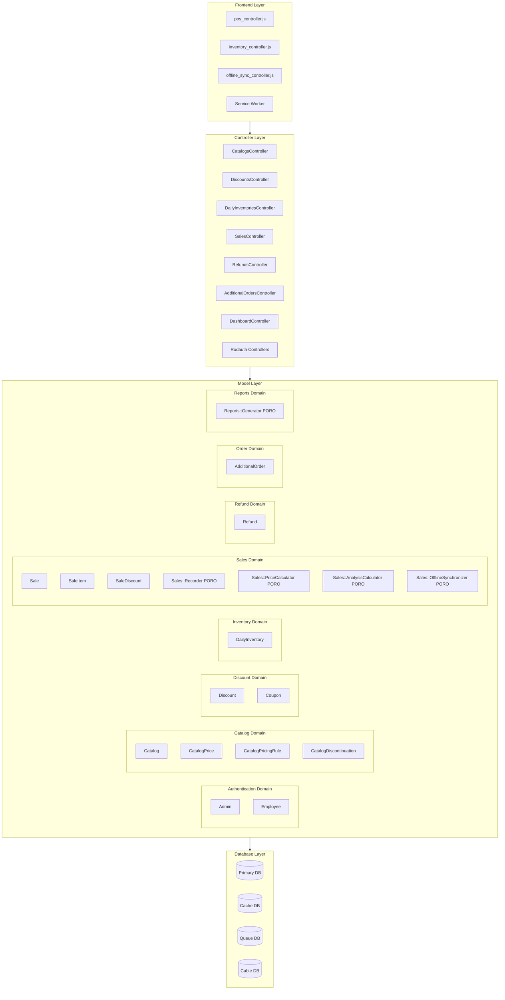
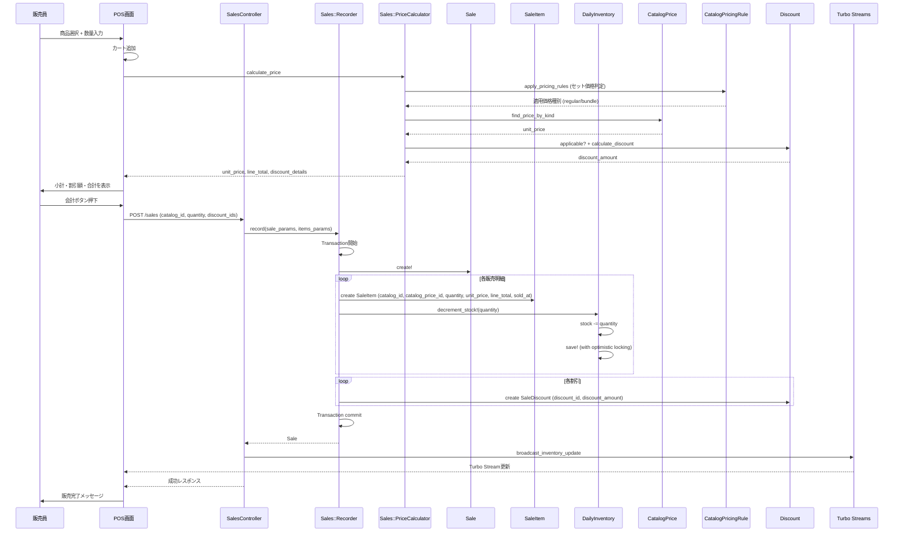
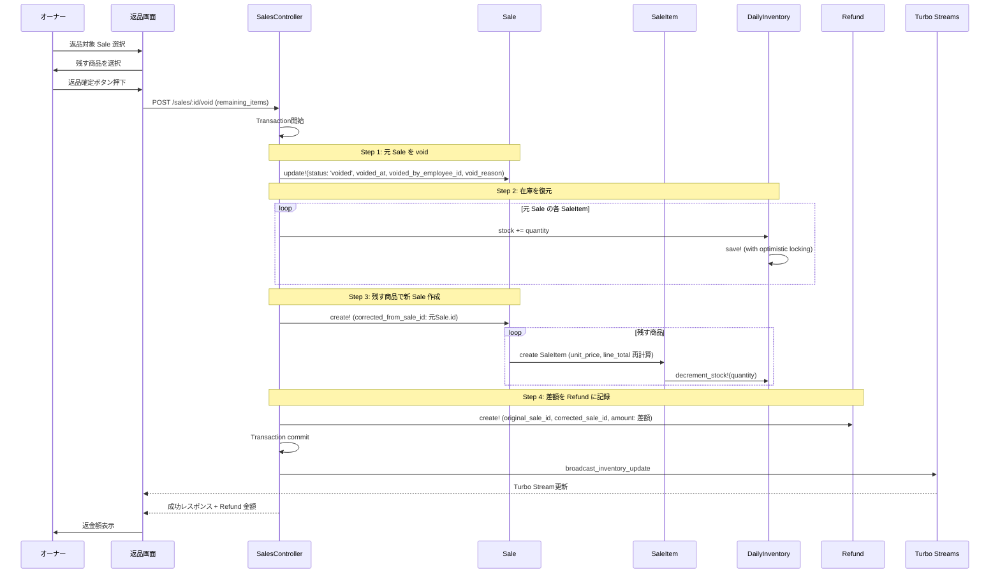
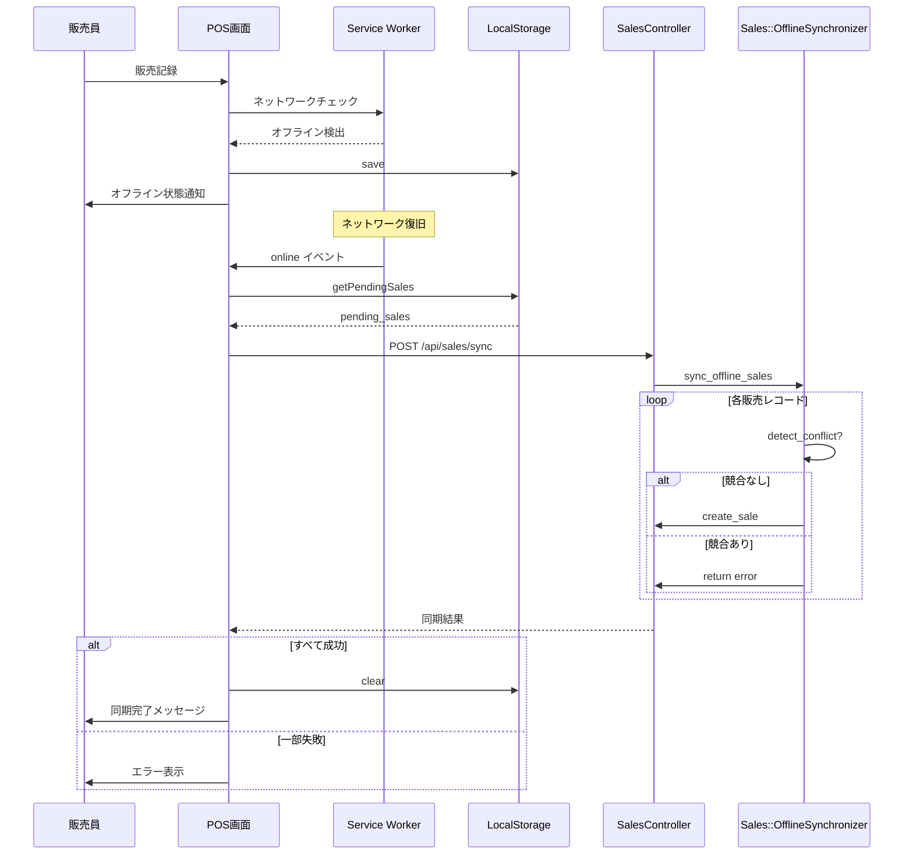

# Technical Design Document

## Overview

本機能は、個人経営の弁当屋における市役所での訪問販売業務を支援するPOSシステムを提供する。主な目的は、販売データを蓄積し、追加発注時の意思決定を定量的な判断軸で行えるようにすることである。副次的に、販売時の計算負荷を軽減(価格ルール適用、複数割引の自動適用、返品・返金処理を含む)し、オーナーがデータを活用できるよう可視化機能を提供する。

**目的**: 販売員(50代女性、スマホ利用)とオーナー(弁当製造・PC利用)に対して、販売記録(価格ルール・複数割引対応、返品・返金処理)、在庫管理、販売予測、データ可視化の機能を提供し、訪問販売業務の効率化とデータドリブンな意思決定を実現する。

**ユーザー**:
- **販売員**: 訪問販売先でスマホを使用してPOS機能、在庫確認、追加発注を実施
- **オーナー**: PCで商品マスタ管理、在庫登録、販売実績レポート、データ可視化、返品・返金処理を実施
- **システム管理者**: 従業員アカウント管理とシステムデバッグ

**影響**: 現在の手動計算とアナログな在庫管理から、デジタル化されたPOSシステムへ移行。販売データの蓄積により、定量的な追加発注判断が可能になる。価格ルール(サラダのセット価格など)と返品・返金処理に対応。

### Goals

- 販売員がスマホで簡単に販売記録を登録でき、暗算や電卓不要で正確な会計を実現
- 価格ルール(サラダのセット価格)とクーポンを自動適用し、正確な価格計算を実現
- リアルタイムで在庫数を確認でき、追加発注の判断材料を提供
- 返品・返金処理を「取消→再販売」フローで実現し、在庫復元と差額返金を正確に記録
- 過去の販売データから追加発注推奨数を算出し、定量的な判断を支援
- オーナーが日次・期間別の販売実績をグラフで可視化し、販売傾向を把握
- オフライン環境でも販売記録を継続でき、ネットワーク復旧後に自動同期
- 販売員とオーナーの両方がスマホ・PCで快適に操作できるレスポンシブUI

### Non-Goals

- 顧客管理機能(顧客名簿、購入履歴など)は対象外
- 弁当製造工程の管理は対象外
- 会計システムとの連携は対象外(手動で会計記録)
- 複数店舗の管理は対象外(単一店舗のみ)
- 高度な在庫予測アルゴリズム(機械学習など)は初期フェーズでは対象外
- 部分返金(行単位返金)は対象外(全体取消→再販売のみ)
- Sale の部分編集は対象外(不変性を保つ)

## Architecture

### Existing Architecture Analysis

本プロジェクトは新規機能であり、既存システムの変更ではない。ただし、以下の既存のプロジェクト標準に準拠する:
- Rails MVC + Hotwire アーキテクチャパターン
- Vite によるフロントエンドビルド
- SQLite3 マルチDB構成(primary, cache, queue, cable)
- Fat Models, Skinny Controllers + PORO パターン
- Service Objects パターンは使用せず、`app/models` 配下に PORO クラスを配置

### Architecture Pattern & Boundary Map

**選択したパターン**: Rails MVC + Hotwire (Turbo + Stimulus)

**アーキテクチャ統合**:
- **選択した理由**:
  - プロジェクト標準に準拠(`docs/steering/structure.md`)
  - Hotwire により SPA のようなインタラクティブ性を実現しつつ、サーバー駆動で複雑性を削減
  - Solid Suite (Solid Cache, Solid Queue, Solid Cable) によりインフラ依存を最小化
  - 37signals の実績あるパターン(Basecamp, HEY)
- **ドメイン/機能境界**:
  - **認証ドメイン**: Admin, Employee (Rodauth で管理)
  - **カタログドメイン**: Catalog, CatalogPrice, CatalogPricingRule, CatalogDiscontinuation
  - **割引ドメイン**: Discount, Coupon, SaleDiscount (中間テーブル)
  - **在庫ドメイン**: DailyInventory (数量ベース方式: stock, reserved_stock)
  - **販売ドメイン**: Sale, SaleItem (価格確定、複数割引対応、取引追跡、void 対応)
  - **返金ドメイン**: Refund (差額返金記録)
  - **発注ドメイン**: AdditionalOrder
  - **分析ドメイン**: Sales::AnalysisCalculator, Reports::Generator (PORO)
- **既存パターンの保持**: Fat Models, Skinny Controllers, Concerns, PORO
- **新規コンポーネントの理由**:
  - Delegated Type (Discount のみ): クーポン拡張性とポリモーフィズムの活用
  - Catalog.category (String Enum): 弁当・サイドメニューの区別（固有フィールド不要のためテーブル分離しない）
  - 数量ベース方式 (DailyInventory): 取引追跡に特化、パフォーマンス向上 (< 5ms)
  - 中間テーブル (SaleDiscount): 複数割引対応、同じ割引の重複適用を防止、監査トレイル
  - CatalogPricingRule: 価格ルール管理(セット価格適用条件など)
  - SaleItem.unit_price, line_total: 販売時の確定単価を記録(価格履歴管理)
  - Sale void フィールド: 取消処理と監査トレイル
  - Refund モデル: 差額返金の記録
  - PORO (Sales::*, Reports::*): Service Objects 禁止のため
- **Steering 準拠**: `docs/steering/structure.md` の PORO 方針、`docs/steering/tech.md` の Hotwire 採用に準拠



**境界間の統合ポイント**:
- POS画面 → SalesController → Sales::Recorder → Sale + SaleItem + DailyInventory（在庫減算）
- 在庫確認 → Turbo Streams → DailyInventory
- 返品処理 → SalesController#void → Sale void + DailyInventory 復元 + 再販売 + Refund 記録
- 販売予測 → AdditionalOrdersController → Sales::AnalysisCalculator → Sale
- レポート → DashboardController → Reports::Generator → Sale + DailyInventory

**詳細は** `research.md` の「アーキテクチャパターンの評価」と「設計決定」セクションを参照。

### Technology Stack & Alignment

| Layer | Choice / Version | Role in Feature | Notes |
|-------|------------------|-----------------|-------|
| **Backend Framework** | Ruby on Rails 8.1.1 | アプリケーション基盤 | プロジェクト標準 |
| **Frontend Build** | Vite 7.3.0 | アセットビルド・HMR | 高速ビルド、モダンJS対応 |
| **Frontend Framework** | Hotwire (Turbo 8.0.20 + Stimulus 3.2.2) | SPA的UX実現 | サーバー駆動、複雑性削減 |
| **Styling** | Tailwind CSS 4.1.18 | レスポンシブUI | ユーティリティファースト、Vite統合 |
| **Authentication** | Rodauth-Rails (latest) | 認証・セッション管理 | マルチアカウント対応、セキュア |
| **Database** | SQLite3 | データ永続化 | マルチDB構成対応 (primary, cache, queue, cable) |
| **Charting** | Chartkick + Chart.js (latest) | データ可視化 | Railsフレンドリー、JSONエンドポイント対応 |
| **Offline** | Service Worker + LocalStorage | オフライン対応 | Turbo公式サポート、IndexedDB永続化 |
| **Real-time** | Turbo Streams + Solid Cable | 在庫リアルタイム更新 | WebSocket、インフラシンプル |
| **Background Jobs** | Solid Queue | 非同期処理 | データベースバック、Redis不要 |
| **Concurrency Control** | Optimistic Locking (lock_version) | 在庫更新競合制御 | Rails標準機能、StaleObjectError |

**選定理由の詳細**:
- **Rodauth**: R1調査で確認。マルチアカウントタイプ対応が容易。
- **Chartkick + Chart.js**: R2調査で確認。Rails統合が容易で、Viteとの相性が良い。
- **Service Worker**: R3調査で確認。Turbo 2025年の新機能でオフライン対応が標準化。
- **Turbo Streams + Solid Cable**: R4調査で確認。Rails 8標準でインフラ複雑性を削減。
- **Delegated Type**: R6調査で確認。37signalsの実績あるパターン。
- **Optimistic Locking**: R7調査で確認。読み取り:書き込み比率が高い在庫管理に最適。
- **String Enum**: R8調査で確認。データベース可読性とデバッグ容易性を優先。
- **Stored Fields**: R9調査で確認。販売記録は不変のため保存して読み取り速度最適化。
- **Void/Refund Pattern**: R10調査で確認。取消→再販売パターンで監査トレイルを保持。

詳細な技術調査は `research.md` の R1~R10 セクションを参照。

## System Flows

### 販売フロー (POS機能 + 価格ルール + 割引適用)



**フロー決定事項**:
- **価格ルール適用**: CatalogPricingRule でセット価格適用条件を判定（弁当1個につきサラダ1個まで）
- **価格確定**: CatalogPrice.kind (regular/bundle) から unit_price を取得し、SaleItem に保存
- **割引適用**: Discount モデルの `applicable?` メソッドに委譲 (ポリモーフィズム)
- **在庫減算**: Sales::Recorder PORO で明示的に実行（DailyInventory の stock から減算）
- **SaleItem**: catalog_id, catalog_price_id, quantity, unit_price, line_total, sold_at を保持（純粋なデータモデル）
- **楽観的ロック**: lock_version で競合検出し、StaleObjectError を rescue
- **Turbo Streams**: リアルタイムに在庫数を全クライアントに配信

### 返品・返金フロー (Void → 再販売)



**フロー決定事項**:
- **取消→再販売**: 元 Sale を void し、新しい Sale を作成（Sale は不変）
- **在庫復元**: void 時に元 Sale の全 SaleItem 数量を DailyInventory.stock に加算
- **再販売**: 残す商品だけで新しい Sale を作成し、価格ルール・クーポンを再評価
- **差額返金**: 元 Sale.final_amount - 新 Sale.final_amount を Refund に記録
- **トランザクション**: void + 在庫復元 + 再販売 + Refund 記録を原子的に実行
- **Turbo Streams**: 在庫更新をリアルタイムに配信

### オフライン同期フロー



**フロー決定事項**:
- Service Worker で online/offline イベントを検出
- オフライン時は LocalStorage に一時保存
- 復旧後に `/api/sales/sync` エンドポイントへバッチ送信
- 競合検出時は最新在庫数を表示し、ユーザーに再試行を促す

## Requirements Traceability

| Requirement | Summary | Components | Interfaces | Flows |
|-------------|---------|------------|------------|-------|
| 1.1, 1.2, 1.3, 1.4, 1.5 | 弁当商品マスタ管理 | Catalog (category enum), CatalogPrice, CatalogPricingRule, CatalogsController | CatalogsController CRUD, CatalogPricesController | - |
| 2.1, 2.2, 2.3, 2.4, 2.5 | 販売日の在庫登録 | DailyInventory, DailyInventoriesController | DailyInventoriesController CRUD, bulk_create_for_date | - |
| 3.1, 3.2, 3.3, 3.4, 3.5, 3.6, 3.7 | 販売記録 (POS機能) | Sale, SaleItem, DailyInventory, SalesController, pos_controller.js, Sales::PriceCalculator, CatalogPricingRule, Discount | SalesController#create, pos_controller.js | 販売フロー |
| 4.1, 4.2, 4.3, 4.4 | リアルタイム在庫確認 | DailyInventory, Turbo Streams, Solid Cable, inventory_controller.js | broadcast_inventory_update, turbo_stream_from | 販売フロー |
| 5.1, 5.2, 5.3, 5.4, 5.5 | 追加発注記録 | AdditionalOrder, AdditionalOrdersController | AdditionalOrdersController#create | - |
| 6.1, 6.2, 6.3, 6.4, 6.5 | 販売データ分析 | Sales::AnalysisCalculator, AdditionalOrdersController | predict_additional_order, calculate_sma | - |
| 7.1, 7.2, 7.3, 7.4, 7.5 | 販売実績レポート | Reports::Generator, DashboardController | generate_daily_report, generate_period_report | - |
| 8.1, 8.2, 8.3, 8.4, 8.5 | 販売データ可視化 | Chartkick, Chart.js, DashboardController | JSON endpoints | - |
| 9.1, 9.2, 9.3, 9.4, 9.5, 9.6, 9.7, 9.8, 9.9, 9.10, 9.11, 9.12, 9.13, 9.14, 9.15 | 認証とユーザー管理 | Admin, Employee, Rodauth, EmployeesController | Rodauth login/logout, Employee CRUD（Admin のみアクセス可能、Employee は 403 エラー） | - |
| 10.1, 10.2, 10.3, 10.4, 10.5 | レスポンシブデザイン | Tailwind CSS, Vite | Tailwind responsive classes | - |
| 11.1, 11.2, 11.3, 11.4, 11.5 | オフライン対応 | Service Worker, LocalStorage, offline_sync_controller.js, Sales::OfflineSynchronizer | /api/sales/sync | オフライン同期フロー |
| 12.1, 12.2, 12.3, 12.4, 12.5 | データ整合性とパフォーマンス | DailyInventory (lock_version), Solid Cache, Indexes | Optimistic Locking, Transaction, Cache | 販売フロー |
| 13.1, 13.2, 13.3, 13.4, 13.5, 13.6, 13.7, 13.8, 13.9 | 割引（クーポン）管理と適用 | Discount, Coupon, SaleDiscount, Sales::PriceCalculator, SalesController | Discount#applicable?, Coupon#max_applicable_quantity, SaleDiscount (中間テーブル) | 販売フロー |
| 14.1, 14.2, 14.3, 14.4, 14.5, 14.6, 14.7, 14.8 | サイドメニュー（サラダ）の条件付き価格設定 | CatalogPricingRule, CatalogPrice, Sales::PriceCalculator, Catalog (category enum) | CatalogPricingRule#applicable?, apply_pricing_rules, CatalogPrice.by_kind | 販売フロー |
| 15.1, 15.2, 15.3, 15.4, 15.5, 15.6, 15.7, 15.8, 15.9, 15.10, 15.11, 15.12 | 返品・返金処理（取消・再販売・差額返金） | Sale, Refund, SalesController#void, Sales::PriceCalculator, DailyInventory | Sale#void!, Refund, corrected_from_sale_id | 返品・返金フロー |
| 16.1, 16.2, 16.3, 16.4, 16.5, 16.6, 16.7 | 販売先（ロケーション）管理 | Location, LocationsController, DailyInventory, Sale, AdditionalOrder | LocationsController CRUD, Location#soft_delete | - |
| 17.1, 17.2, 17.3, 17.4, 17.5, 17.6, 17.7 | 価格ルール適用時の価格存在検証（会計時） | Sales::Recorder, Sales::PriceCalculator, Catalog::PriceValidator | Sales::PriceCalculator.validate_prices!, Catalog::PriceValidator.validate! | 販売フロー |
| 18.1, 18.2, 18.3, 18.4, 18.5, 18.6 | 管理画面での価格設定不備の警告表示 | Catalog, CatalogPricingRule, CatalogsController, catalogs/index view | Catalog#missing_prices_for_rules, Catalog.with_missing_prices | - |
| 19.1, 19.2, 19.3, 19.4, 19.5, 19.6, 19.7 | 価格ルール作成・有効化時の価格存在バリデーション | Catalog::PricingRuleCreator, CatalogPricingRule | Catalog::PricingRuleCreator#create, #update | - |

## Components & Interface Contracts

### Components Summary

| Component | Domain/Layer | Intent | Req Coverage | Key Dependencies | Contracts |
|-----------|--------------|--------|--------------|------------------|-----------|
| Admin | Authentication | システム開発者アカウント（Rails console のみ、Employee 管理画面へのアクセス権限） | 9.1-9.15 | Rodauth (P0) | Service |
| Employee | Authentication | 業務ユーザーアカウント（オーナー + 販売員、Employee 管理画面はアクセス不可） | 9.1-9.15 | Rodauth (P0), Admin (P0) | Service, API |
| Location | Location Domain | 販売先マスタ（配達状態管理: active/inactive） | 16.1-16.7 | - | Service |
| Catalog | Catalog Domain | 商品カタログモデル（category enum） | 1.1-1.5, 14.1-14.8 | CatalogPrice, CatalogPricingRule (P0) | Service |
| CatalogPrice | Catalog Domain | 価格管理（種別別: regular/bundle） | 1.1-1.5, 14.1-14.8 | Catalog (P0) | Service |
| CatalogPricingRule | Catalog Domain | 価格ルール管理（セット価格適用条件） | 1.1-1.5, 14.1-14.8 | Catalog (P0) | Service |
| Discount | Discount Domain | 割引抽象モデル（delegated_type） | 3.1-3.7, 13.1-13.9 | Coupon (P0) | Service |
| Coupon | Discount Domain | クーポンマスタ（50円引き、弁当1個につき1枚） | 3.1-3.7, 13.1-13.9 | Discount (P0) | Service |
| SaleDiscount | Sales Domain | 販売・割引中間テーブル（監査トレイル、複数割引対応） | 3.1-3.7, 13.1-13.9 | Sale (P0), Discount (P0) | - |
| DailyInventory | Inventory Domain | 販売先ごとの日次在庫管理（返品時に在庫復元） | 2.1-2.6, 3.1-3.8, 4.1-4.5, 15.1-15.12, 16.1-16.7 | Location (P0), Catalog (P0), Sale (P1) | Service, State |
| Sale | Sales Domain | 販売記録（販売先ごと、void 対応、取消→再販売） | 3.1-3.8, 15.1-15.12, 16.1-16.7 | Location (P0), DailyInventory (P0), Discount (P1), SaleItem (P0) | API |
| SaleItem | Sales Domain | 販売明細（単価確定、価格履歴管理、純粋データモデル） | 3.1-3.8, 14.1-14.8 | Sale (P0), Catalog (P0), CatalogPrice (P0) | Service |
| Refund | Refund Domain | 差額返金記録（元Sale - 新Sale） | 15.1-15.12 | Sale (P0) | API |
| Sales::Recorder | Sales PORO | 販売記録と在庫減算の一括処理（PriceCalculator経由で価格検証）※決定18 | 3.1-3.8, 12.1-12.2, 17.1-17.7 | Sale (P0), SaleItem (P0), DailyInventory (P0), Sales::PriceCalculator (P0) | Service |
| Sales::PriceCalculator | Sales PORO | 販売価格計算（kind 決定 + 価格存在検証 + 価格ルール + 割引）※決定18 | 3.1-3.8, 13.1-13.9, 14.1-14.8, 17.1-17.7 | CatalogPricingRule (P0), Discount (P0), Catalog::PriceValidator (P0) | Service |
| Catalog::PriceValidator | Catalog PORO | (catalog_id, kind, at) の価格存在検証（薄い部品）※決定18 | 17.1-17.7, 18.1-18.6 | CatalogPrice (P0) | Service |
| Catalog::PricingRuleCreator | Catalog PORO | 価格ルールの作成・更新と価格存在検証 | 19.1-19.7 | CatalogPricingRule (P0), CatalogPrice (P0) | Service |
| Sales::AnalysisCalculator | Sales PORO | 販売予測・統計 | 6.1-6.5 | Sale (P0) | Service |
| Reports::Generator | Reports PORO | レポート生成 | 7.1-7.5 | Sale (P0), DailyInventory (P0) | Service |
| pos_controller.js | Frontend Stimulus | POS UI制御（クーポン枚数入力、価格内訳表示） | 3.1-3.8, 13.1-13.9, 14.1-14.8 | SalesController (P0) | State |

### Location Domain

#### Location

| Field | Detail |
|-------|--------|
| Intent | 販売先マスタ（市役所、県庁など） |
| Requirements | 16.1, 16.2, 16.3, 16.4, 16.5, 16.6, 16.7 |

**Responsibilities & Constraints**
- 販売先の名称管理
- 配達状態管理（status enum で管理）
- 配達停止中の販売先に紐づく在庫・販売記録の参照保証

**Dependencies**
- Outbound: DailyInventory — 販売先ごとの在庫管理 (P0)
- Outbound: Sale — 販売先ごとの販売記録 (P0)
- Outbound: AdditionalOrder — 販売先ごとの追加発注記録 (P0)

**Contracts**: Service [x]

**Service Interface**:
```ruby
class Location < ApplicationRecord
  has_many :daily_inventories, dependent: :restrict_with_error
  has_many :sales, dependent: :restrict_with_error
  has_many :additional_orders, dependent: :restrict_with_error

  # 配達状態管理（active / inactive）
  enum status: { active: 'active', inactive: 'inactive' }

  # デフォルトスコープで active のみ取得
  default_scope { where(status: 'active') }

  def deactivate
    update(status: :inactive)
  end

  def activate
    update(status: :active)
  end

  def active?
    status == 'active'
  end
end
```

**Implementation Notes**:
- 状態管理パターンを採用（status enum: active / inactive）
- 配達停止時（deactivate）は過去データとの整合性を保つため、関連レコード（DailyInventory, Sale, AdditionalOrder）が存在しても状態変更可能
- デフォルトスコープで status = 'active' のレコードのみ取得
- unscoped で inactive 状態のレコードも取得可能
- 将来的な拡張: suspended（一時停止）などの状態追加が容易

---

### Authentication Domain

#### Admin

| Field | Detail |
|-------|--------|
| Intent | システム開発者アカウント（デバッグ・運用サポート） |
| Requirements | 9.1, 9.2, 9.8, 9.9, 9.10, 9.11, 9.12, 9.13, 9.14, 9.15 |

**Responsibilities & Constraints**
- システム開発者のみのアカウント
- Rails console でのみ作成・編集・削除（UI 不要）
- Employee の CRUD 権限を持つ（EmployeesController へのアクセス）
- 認可機能不要（すべての機能にアクセス可能）

**Dependencies**
- Outbound: Employee — Employee CRUD 操作 (P0)
- External: Rodauth — 認証・セッション管理 (P0)

**Contracts**: Service [x]

**Service Interface**:
```ruby
class Admin < ApplicationRecord
  include Rodauth::Rails.model # Rodauth 統合

  has_many :employees, foreign_key: 'created_by_admin_id', dependent: :nullify

  validates :email, presence: true, uniqueness: true
  validates :name, presence: true

  # Rodauth によるパスワード管理（bcrypt ハッシュ化）
end
```

**Implementation Notes**:
- **Rails console のみ**: `Admin.create!(email: '...', password: '...', name: '...')` で作成
- **UI 不要**: Admin 用の CRUD コントローラーは実装しない
- **認可不要**: Admin は全機能にアクセス可能（認可チェック不要）
- **Rodauth 統合**: 共通ログイン画面で Admin と Employee を認証
- **将来的な拡張**: Admin 管理 UI が必要になった場合は `Admin::EmployeesController` を追加可能

---

#### Employee

| Field | Detail |
|-------|--------|
| Intent | 業務ユーザーアカウント（オーナー + 販売員） |
| Requirements | 9.1, 9.2, 9.3, 9.4, 9.5, 9.6, 9.7, 9.10, 9.11, 9.12, 9.13, 9.14, 9.15 |

**Responsibilities & Constraints**
- オーナーと販売員を一律で扱う業務ユーザー
- 機能的な区別なし（認可機能不要）
- すべての業務機能にアクセス可能

**Dependencies**
- Inbound: Admin — 作成・編集・削除操作 (P0)
- External: Rodauth — 認証・セッション管理 (P0)
- Outbound: Sale — 販売記録の作成者 (P1)
- Outbound: AdditionalOrder — 追加発注の作成者 (P1)

**Contracts**: Service [x], API [x]

**Service Interface**:
```ruby
class Employee < ApplicationRecord
  include Rodauth::Rails.model # Rodauth 統合

  has_many :sales, dependent: :nullify
  has_many :additional_orders, dependent: :nullify
  has_many :voided_sales, class_name: 'Sale', foreign_key: 'voided_by_employee_id', dependent: :nullify
  has_many :refunds, dependent: :nullify
  belongs_to :created_by_admin, class_name: 'Admin', optional: true

  validates :email, presence: true, uniqueness: true
  validates :name, presence: true

  # Rodauth によるパスワード管理（bcrypt ハッシュ化）
end
```

**API Contract**:

| Method | Endpoint | Request | Response | Errors |
|--------|----------|---------|----------|--------|
| GET | /employees | - | Employee[] | 401, 500 |
| GET | /employees/:id | - | Employee | 404, 500 |
| POST | /employees | CreateEmployeeRequest | Employee | 400, 422, 500 |
| PATCH | /employees/:id | UpdateEmployeeRequest | Employee | 400, 404, 422, 500 |
| DELETE | /employees/:id | - | - | 404, 500 |

**CreateEmployeeRequest**:
```ruby
{
  employee: {
    email: String,
    password: String,
    name: String
  }
}
```

**UpdateEmployeeRequest**:
```ruby
{
  employee: {
    email: String (optional),
    password: String (optional),
    name: String (optional)
  }
}
```

**Implementation Notes**:
- **Admin のみ CRUD 可能**: EmployeesController へのアクセスは Admin のみに制限（`before_action :require_admin_authentication`）
- **認可制御実装**: rodauth-rails の公式機能を使用
  - `rodauth(:employee).logged_in?` で Employee ログイン判定 → 403 エラー
  - `rodauth(:admin).require_account` で Admin 認証を強制 → 未認証時はログインページにリダイレクト
- **業務機能は認可不要**: Employee はすべての業務機能（POS、在庫、レポートなど）にアクセス可能（権限チェック不要）
- **Rodauth 統合**: 共通ログイン画面で Admin と Employee を認証（複数アカウント設定: `:admin`, `:employee`）
- **エラーハンドリング**: Employee が Employee管理画面にアクセスすると 403 Forbidden を返す
- **将来的な拡張**: オーナーと販売員を区別する role フィールド追加が容易

---

### Catalog Domain

#### Catalog

| Field | Detail |
|-------|--------|
| Intent | 商品カタログモデル（弁当・サイドメニュー） |
| Requirements | 1.1-1.5 |

**Responsibilities**:
- 商品マスタ管理（name, category, description）
- category enum で弁当・サイドメニューを区別
- 価格情報、価格ルール、提供終了状態の関連管理

**Service Interface**:
```ruby
class Catalog < ApplicationRecord
  has_many :catalog_prices, dependent: :destroy
  has_many :catalog_pricing_rules, foreign_key: 'target_catalog_id', dependent: :destroy
  has_one :catalog_discontinuation, dependent: :destroy
  has_many :daily_inventories, dependent: :destroy

  enum category: { bento: 'bento', side_menu: 'side_menu' }

  validates :name, presence: true, uniqueness: true
  validates :category, presence: true

  def current_price
    catalog_prices.current.first
  end

  def discontinued?
    catalog_discontinuation.present?
  end
end
```

**Implementation Notes**:
- category は String Enum（`bento: 'bento', side_menu: 'side_menu'`）
- Bento, SideMenu テーブルは作成しない（固有フィールドが不要のため）
- 将来的に固有フィールドが必要になった場合は delegated_type に移行可能

#### CatalogPrice

| Field | Detail |
|-------|--------|
| Intent | 商品価格を種別別に管理（regular / bundle） |
| Requirements | 1.1, 1.5 |

**Responsibilities**:
- 価格種別（regular / bundle）ごとの価格管理
- 有効期間管理（effective_from, effective_until）
- 現在有効な価格の取得

**Service Interface**:
```ruby
class CatalogPrice < ApplicationRecord
  belongs_to :catalog

  enum kind: { regular: 'regular', bundle: 'bundle' }

  validates :price, presence: true, numericality: { greater_than: 0 }
  validates :kind, presence: true
  validates :effective_from, presence: true

  scope :current, -> { where('effective_from <= ? AND (effective_until IS NULL OR effective_until >= ?)', Time.current, Time.current) }
  scope :by_kind, ->(kind) { where(kind: kind) }

  def self.current_price_by_kind(catalog_id, kind)
    where(catalog_id: catalog_id).by_kind(kind).current.first
  end
end
```

**Implementation Notes**:
- kind は String Enum（`regular: 'regular', bundle: 'bundle'`）
- R8 調査で確認：データベース可読性とデバッグ容易性を優先
- 将来的な価格種別追加が容易（例: member, limited_time）

#### CatalogPricingRule

| Field | Detail |
|-------|--------|
| Intent | 価格ルール管理（セット価格適用条件など） |
| Requirements | 1.1-1.5 |

**Responsibilities**:
- どの商品（target_catalog）にどの価格種別（price_kind）を適用するか定義
- 適用条件（trigger_category, max_per_trigger）の管理
- 有効期間管理（valid_from, valid_until）
- **注意**: 価格存在検証はモデルバリデーションではなく `Catalog::PricingRuleCreator` PORO で実行

**Service Interface**:
```ruby
class CatalogPricingRule < ApplicationRecord
  belongs_to :target_catalog, class_name: 'Catalog', foreign_key: 'target_catalog_id'

  validates :target_catalog_id, presence: true
  validates :price_kind, presence: true, inclusion: { in: %w[regular bundle] }
  validates :trigger_category, presence: true
  validates :max_per_trigger, presence: true, numericality: { greater_than_or_equal_to: 0 }

  scope :active, -> { where('valid_from <= ? AND (valid_until IS NULL OR valid_until >= ?)', Date.today, Date.today) }
  scope :for_target, ->(catalog_id) { where(target_catalog_id: catalog_id) }
  scope :triggered_by, ->(category) { where(trigger_category: category) }

  def applicable?(cart_items)
    trigger_count = cart_items.count { |item| item[:catalog].category == trigger_category }
    trigger_count > 0
  end

  def max_applicable_quantity(cart_items)
    trigger_count = cart_items.count { |item| item[:catalog].category == trigger_category }
    [trigger_count * max_per_trigger, Float::INFINITY].min
  end
end
```

**Implementation Notes**:
- 例: サラダのセット価格ルール
  - target_catalog_id: サラダの catalog_id
  - price_kind: 'bundle'
  - trigger_category: 'bento'
  - max_per_trigger: 1（弁当1個につきサラダ1個まで）
- `applicable?` で適用可否を判定
- `max_applicable_quantity` で最大適用数を計算
- **Requirement 19 対応**: 価格存在検証は `Catalog::PricingRuleCreator` PORO で実行（モデルバリデーションでは他モデルに依存しない）

### Discount Domain

#### Discount (抽象モデル) - delegated_type

**Responsibilities**:
- 割引・クーポンの抽象化 (Coupon を統一的に扱う)
- 割引適用可能性の判定と割引額計算を discountable に委譲

**Service Interface**:
```ruby
class Discount < ApplicationRecord
  has_many :sale_discounts, dependent: :destroy
  has_many :sales, through: :sale_discounts
  delegated_type :discountable, types: %w[Coupon]

  delegate :applicable?, to: :discountable

  # クーポンの場合: discountable が割引額計算を担当
  def calculate_discount(sale_items = [])
    return 0 unless discountable.applicable?(sale_items)
    discountable.calculate_discount(sale_items)
  end
end
```

**Implementation Notes**: R6調査で確認済み。delegated_type パターンで柔軟な割引ロジックを実現。has_many :through で複数販売に適用可能。

#### Coupon

**Service Interface**:
```ruby
class Coupon < ApplicationRecord
  has_one :discount, as: :discountable, touch: true

  validates :description, presence: true
  validates :amount_per_unit, presence: true, numericality: { greater_than: 0 }
  validates :max_per_bento_quantity, presence: true, numericality: { greater_than_or_equal_to: 0 }

  def applicable?(sale_items)
    bento_quantity = sale_items
      .select { |item| item[:catalog].category == 'bento' }
      .sum { |item| item[:quantity] }
    bento_quantity > 0
  end

  def max_applicable_quantity(sale_items)
    # Requirement 13.2, 13.8: 弁当の種類ではなく、個数ベースでカウント
    # 複数種類の弁当がある場合は各 quantity の合計
    bento_quantity = sale_items
      .select { |item| item[:catalog].category == 'bento' }
      .sum { |item| item[:quantity] }
    bento_quantity * max_per_bento_quantity
  end

  def calculate_discount(sale_items)
    max_quantity = max_applicable_quantity(sale_items)
    # クーポン枚数は外部から渡される想定（Sales::PriceCalculator で制御）
    # ここでは最大適用可能枚数を返す
    max_quantity * amount_per_unit
  end
end
```

**Implementation Notes**:
- 例: 50円割引クーポン
  - amount_per_unit: 50
  - max_per_bento_quantity: 1（弁当1個につき1枚まで）
- クーポン適用上限は弁当の種類ではなく、購入した弁当の合計個数（quantity の合計）でカウント
  - 例: 日替わりA 3個 + 日替わりB 2個 = 弁当5個 → クーポン最大5枚適用可能

### Sales Domain

#### SaleItem (販売明細)

**Responsibilities**:
- 取引の記録（どの商品が何個売れたか）
- **販売時の確定単価を保持**（unit_price, line_total）
- 販売時の価格 (catalog_price_id) を保持
- 販売日時 (sold_at) を記録
- **純粋なデータモデル**（在庫減算は Sales::Recorder PORO で実行）

**Service Interface**:
```ruby
class SaleItem < ApplicationRecord
  belongs_to :sale
  belongs_to :catalog
  belongs_to :catalog_price

  validates :quantity, presence: true, numericality: { greater_than: 0 }
  validates :unit_price, presence: true, numericality: { greater_than_or_equal_to: 0 }
  validates :line_total, presence: true, numericality: { greater_than_or_equal_to: 0 }
  validates :sold_at, presence: true

  before_validation :calculate_line_total

  private

  def calculate_line_total
    return unless unit_price.present? && quantity.present?
    self.line_total = unit_price * quantity
  end
end
```

**Implementation Notes**:
- unit_price: 販売時に確定した単価（価格ルール適用後）
- line_total: unit_price × quantity（R9 調査で Stored を採用）
- catalog_price_id: 基準価格を参照（価格履歴管理）
- **在庫減算は Sales::Recorder PORO で明示的に実行**（SaleItem はコールバックを持たない純粋データモデル）

#### Sale

**Responsibilities**:
- 販売記録の管理
- **Void 処理対応**（取消、理由、再販売元記録）
- 複数割引の記録
- トランザクション整合性の保証

**API Contract**:

| Method | Endpoint | Request | Response | Errors |
|--------|----------|---------|----------|--------|
| POST | /sales | CreateSaleRequest | Sale | 400, 409, 422, 500 |
| POST | /sales/:id/void | VoidSaleRequest | VoidSaleResponse | 400, 422, 500 |

**CreateSaleRequest**:
```ruby
{
  sale: {
    customer_type: 'staff' | 'citizen',
    discount_ids: [Integer],
    sale_items_attributes: [
      { catalog_id: Integer, catalog_price_id: Integer, quantity: Integer, unit_price: Integer }
    ]
  }
}
```

**VoidSaleRequest**:
```ruby
{
  void_reason: String,
  remaining_items: [
    { catalog_id: Integer, quantity: Integer }
  ]
}
```

**VoidSaleResponse**:
```ruby
{
  original_sale_id: Integer,
  corrected_sale_id: Integer,
  refund_amount: Integer,
  message: String
}
```

**Service Interface**:
```ruby
class Sale < ApplicationRecord
  has_many :sale_items, dependent: :destroy
  has_many :sale_discounts, dependent: :destroy
  has_many :discounts, through: :sale_discounts
  belongs_to :employee, optional: true
  belongs_to :corrected_from_sale, class_name: 'Sale', optional: true
  has_one :correction_sale, class_name: 'Sale', foreign_key: 'corrected_from_sale_id'

  enum customer_type: { staff: 'staff', citizen: 'citizen' }
  enum status: { completed: 'completed', voided: 'voided' }

  validates :sale_datetime, presence: true
  validates :customer_type, presence: true
  validates :total_amount, presence: true, numericality: { greater_than: 0 }
  validates :final_amount, presence: true, numericality: { greater_than: 0 }
  validates :status, presence: true

  def total_discount_amount
    sale_discounts.sum(:discount_amount)
  end

  def void!(reason:, voided_by:, remaining_items: [])
    transaction do
      # Step 1: 元 Sale を void
      update!(
        status: :voided,
        voided_at: Time.current,
        voided_by_employee_id: voided_by.id,
        void_reason: reason
      )

      # Step 2: 在庫を復元
      sale_items.each do |item|
        inventory = DailyInventory.find_by!(catalog_id: item.catalog_id, inventory_date: item.sold_at.to_date)
        inventory.stock += item.quantity
        inventory.save!
      end

      # Step 3: 残す商品で新 Sale 作成
      if remaining_items.any?
        new_sale = Sale.create_with_items_and_discounts!(
          {
            sale_datetime: Time.current,
            customer_type: customer_type,
            employee_id: voided_by.id,
            corrected_from_sale_id: id
          },
          remaining_items,
          discount_ids: []
        )
      else
        new_sale = nil
      end

      # Step 4: 差額を Refund に記録
      refund_amount = new_sale ? final_amount - new_sale.final_amount : final_amount
      Refund.create!(
        original_sale_id: id,
        corrected_sale_id: new_sale&.id,
        employee_id: voided_by.id,
        refund_datetime: Time.current,
        amount: refund_amount,
        reason: reason
      )

      { corrected_sale: new_sale, refund_amount: refund_amount }
    end
  end

  def self.create_with_items_and_discounts!(sale_params, items_params, discount_ids: [])
    transaction do
      # 価格計算
      pricing = Sales::PriceCalculator.calculate(items_params, discount_ids)

      sale = create!(
        sale_params.merge(
          total_amount: pricing[:subtotal],
          final_amount: pricing[:final_total],
          status: :completed
        )
      )

      # 販売明細作成
      items_params.each do |item|
        SaleItem.create!(
          sale: sale,
          catalog_id: item[:catalog_id],
          catalog_price_id: item[:catalog_price_id],
          quantity: item[:quantity],
          unit_price: item[:unit_price],
          sold_at: sale.sale_datetime
        )
      end

      # 割引適用
      pricing[:discount_details].each do |detail|
        next unless detail[:applicable]
        SaleDiscount.create!(
          sale: sale,
          discount_id: detail[:discount_id],
          discount_amount: detail[:discount_amount]
        )
      end

      sale
    end
  end
end
```

**Implementation Notes**:
- status: completed / voided（String Enum、R8 調査）
- void!: 取消→在庫復元→再販売→返金記録を原子的に実行
- トランザクション内で整合性を保証
- StaleObjectError を rescue して再試行を促す

#### SaleDiscount (中間テーブル)

**Responsibilities**:
- Sale と Discount の多対多関係を管理
- 各割引の適用額を記録
- 同じ割引の重複適用を防止（ユニーク制約）

**Service Interface**:
```ruby
class SaleDiscount < ApplicationRecord
  belongs_to :sale
  belongs_to :discount

  validates :discount_amount, presence: true, numericality: { greater_than: 0 }
  validates :discount_id, uniqueness: { scope: :sale_id, message: "同じ割引を複数回適用できません" }
end
```

**Implementation Notes**: 中間テーブルで複数割引対応を実現。discount_id の uniqueness バリデーション（scope: :sale_id）と DB レベルのユニークインデックスで同じ割引の重複適用を防止。各割引の適用額を discount_amount に保存。

### Refund Domain

#### Refund

| Field | Detail |
|-------|--------|
| Intent | 差額返金の記録 |
| Requirements | - |

**Responsibilities**:
- 元 Sale と corrected Sale の差額を記録
- 返金理由の記録
- 返金処理の監査トレイル

**API Contract**:

| Method | Endpoint | Request | Response | Errors |
|--------|----------|---------|----------|--------|
| GET | /refunds | - | Refund[] | 401, 500 |
| GET | /refunds/:id | - | Refund | 404, 500 |

**Service Interface**:
```ruby
class Refund < ApplicationRecord
  belongs_to :original_sale, class_name: 'Sale'
  belongs_to :corrected_sale, class_name: 'Sale', optional: true
  belongs_to :employee, optional: true

  validates :original_sale_id, presence: true
  validates :amount, presence: true, numericality: { greater_than_or_equal_to: 0 }
  validates :refund_datetime, presence: true
  validates :reason, presence: true
end
```

**Implementation Notes**:
- amount: 元 Sale.final_amount - corrected Sale.final_amount
- corrected_sale_id: nullable（全額返金の場合は nil）
- 返金理由を reason に記録

### Catalog PORO

#### Catalog::PriceValidator

| Field | Detail |
|-------|--------|
| Intent | 指定された (catalog_id, kind, at) の価格が存在するかを検証する薄い PORO |
| Requirements | 17.1-17.7, 18.1-18.6 |

**Responsibilities**:
- 指定された (catalog_id, kind, at) に対応する CatalogPrice の存在を検証（単一責務）
- 価格の取得（存在しない場合は nil または例外）
- 商品一覧画面での価格設定不備の検出（Requirement 18）
- **注意**: 「何の kind が必要か」の判定は Sales::PriceCalculator が担当（決定18参照）

**Dependencies**:
- CatalogPrice (P0)

**Service Interface**:
```ruby
module Catalog
  class PriceValidator
    # 指定された (catalog_id, kind, at) の価格が存在するか検証
    # @param catalog_id [Integer]
    # @param kind [String] 'regular' | 'bundle'
    # @param at [Date] 基準日（デフォルト: 今日）
    # @return [Boolean]
    def self.price_exists?(catalog_id, kind, at: Date.current)
      CatalogPrice
        .where(catalog_id: catalog_id, kind: kind)
        .where('effective_from <= ?', at)
        .where('effective_until IS NULL OR effective_until >= ?', at)
        .exists?
    end

    # 価格を取得（存在しない場合は nil）
    # @param catalog_id [Integer]
    # @param kind [String]
    # @param at [Date]
    # @return [CatalogPrice, nil]
    def self.find_price(catalog_id, kind, at: Date.current)
      CatalogPrice.current_price_by_kind!(catalog_id, kind, at)
    rescue CatalogPrice::NotFoundError
      nil
    end

    # 価格を取得（存在しない場合は例外）
    # @param catalog_id [Integer]
    # @param kind [String]
    # @param at [Date]
    # @return [CatalogPrice]
    # @raise [CatalogPrice::NotFoundError] 価格が存在しない場合
    def self.find_price!(catalog_id, kind, at: Date.current)
      CatalogPrice.current_price_by_kind!(catalog_id, kind, at)
    end

    # 商品一覧用: 価格設定に不備がある商品を取得（Requirement 18）
    # @return [Array<Hash>] [{ catalog:, missing_kinds: [...] }, ...]
    def self.catalogs_with_missing_prices
      result = []

      ::Catalog.available.includes(:catalog_prices, :catalog_pricing_rules).find_each do |catalog|
        missing_kinds = []

        # 通常価格チェック（全商品で必須）
        unless price_exists?(catalog.id, 'regular')
          missing_kinds << "regular"
        end

        # 有効な価格ルールが参照する価格種別をチェック
        catalog.active_pricing_rules.each do |rule|
          next if rule.price_kind == "regular"
          unless price_exists?(catalog.id, rule.price_kind)
            missing_kinds << rule.price_kind
          end
        end

        result << { catalog: catalog, missing_kinds: missing_kinds.uniq } if missing_kinds.any?
      end

      result
    end
  end
end
```

**Implementation Notes**:
- **薄い部品**: 価格ルールの適用判定は行わず、指定された (catalog_id, kind, at) の価格存在のみを検証
- **決定18 対応**: 「何の kind が必要か」は Sales::PriceCalculator が決定し、PriceValidator を呼び出して検証
- `price_exists?`: Boolean を返す軽量な存在チェック
- `find_price` / `find_price!`: 価格取得（CatalogPrice.current_price_by_kind! に委譲）
- `catalogs_with_missing_prices`: 管理画面警告表示用（Requirement 18）、価格ルールが参照する kind を静的にチェック

---

#### Catalog::PricingRuleCreator

| Field | Detail |
|-------|--------|
| Intent | 価格ルールの作成・更新と価格存在検証を行う PORO |
| Requirements | 19.1-19.7 |

**Responsibilities**:
- 価格ルール作成時に対応する CatalogPrice の存在を検証（19.1）
- 価格ルール有効化時に対応する CatalogPrice の存在を検証（19.2）
- 検証失敗時にエラーメッセージを返す（19.3, 19.4）
- 今日時点で有効な CatalogPrice が存在すれば許可（19.5）
- 無効化時は価格存在の検証をスキップ（19.7）

**Dependencies**:
- CatalogPricingRule (P0)
- CatalogPrice (P0)

**Service Interface**:
```ruby
module Catalog
  class PricingRuleCreator
    # 価格存在検証エラー
    class MissingPriceError < StandardError
      attr_reader :catalog_name, :price_kind

      def initialize(catalog_name, price_kind)
        @catalog_name = catalog_name
        @price_kind = price_kind
        super("価格種別「#{price_kind}」に対応する価格が商品「#{catalog_name}」に設定されていません")
      end
    end

    # 価格ルールを作成する
    # @param rule_params [Hash] CatalogPricingRule の属性
    # @return [CatalogPricingRule] 作成されたルール
    # @raise [MissingPriceError] 対応する価格が存在しない場合
    # @raise [ActiveRecord::RecordInvalid] バリデーションエラー
    def create(rule_params)
      rule = CatalogPricingRule.new(rule_params)
      validate_price_existence!(rule) if should_validate?(rule)
      rule.save!
      rule
    end

    # 価格ルールを更新する
    # @param rule [CatalogPricingRule] 更新対象のルール
    # @param rule_params [Hash] 更新する属性
    # @return [CatalogPricingRule] 更新されたルール
    # @raise [MissingPriceError] 対応する価格が存在しない場合
    # @raise [ActiveRecord::RecordInvalid] バリデーションエラー
    def update(rule, rule_params)
      rule.assign_attributes(rule_params)
      validate_price_existence!(rule) if should_validate?(rule)
      rule.save!
      rule
    end

    private

    # 価格存在検証を実行すべきか判定
    # - 有効化（valid_from が今日以前）の場合: 検証する
    # - 無効化（valid_from が将来）の場合: スキップ（19.7）
    def should_validate?(rule)
      rule.valid_from <= Date.current
    end

    # 価格存在検証（Requirement 19）
    def validate_price_existence!(rule)
      catalog = rule.target_catalog
      return if catalog.nil?

      price_exists = catalog.prices.by_kind(rule.price_kind).current.exists?
      return if price_exists

      raise MissingPriceError.new(catalog.name, rule.price_kind)
    end
  end
end
```

**Implementation Notes**:
- `create`: 新規ルール作成時に価格存在検証を実行（19.1）
- `update`: ルール更新時に価格存在検証を実行（19.2）
- `should_validate?`: 有効化時のみ検証、無効化時はスキップ（19.7）
- 今日時点で有効な CatalogPrice が存在すれば許可（19.5）
- モデルバリデーションで他モデルに依存せず、PORO でユーザーイベント起点の検証を担保

---

### Sales PORO

#### Sales::Recorder

| Field | Detail |
|-------|--------|
| Intent | 販売記録と在庫減算を一括で処理する PORO |
| Requirements | 3.1-3.8, 12.1-12.2, 17.1-17.7 |

**Responsibilities**:
- Sale と SaleItem の作成を一括で実行
- 価格計算（Sales::PriceCalculator 経由で価格存在検証も実行）
- 在庫減算（DailyInventory）を明示的に実行
- トランザクション内で原子性を保証
- 在庫不足時・価格不足時にエラーを発生させる

**Dependencies**:
- Sale (P0)
- SaleItem (P0)
- DailyInventory (P0)
- Sales::PriceCalculator (P0)

**Service Interface**:
```ruby
module Sales
  class Recorder
    # 販売を記録し、在庫を減算する
    # @param sale_params [Hash] Sale の属性
    # @param items_params [Array<Hash>] [{ catalog_id:, quantity: }, ...]
    # @param discount_ids [Array<Integer>] 適用する割引の ID
    # @param coupon_count [Integer] クーポン枚数
    # @return [Sale] 作成された Sale
    # @raise [Sales::PriceCalculator::MissingPriceError] 価格未設定時（Requirement 17）
    # @raise [DailyInventory::InsufficientStockError] 在庫不足時
    # @raise [ActiveRecord::RecordNotFound] 在庫レコード未存在時
    def record(sale_params, items_params, discount_ids: [], coupon_count: 0)
      # Step 1: カート構築
      cart_items = items_params.map do |p|
        { catalog: Catalog.find(p[:catalog_id]), quantity: p[:quantity] }
      end

      # Step 2: 価格計算（内部で価格存在検証を実行）
      # - determine_price_kinds: 価格ルール適用（どの kind が必要かを決定）
      # - validate_prices!: Catalog::PriceValidator を使って価格存在を検証
      # - fetch_prices: 価格取得
      pricing = PriceCalculator.calculate(cart_items, discount_ids, coupon_count: coupon_count)

      Sale.transaction do
        sale = Sale.create!(
          sale_params.merge(
            total_amount: pricing[:subtotal],
            final_amount: pricing[:final_total],
            status: :completed
          )
        )

        pricing[:items_with_prices].each do |item|
          sale_item = sale.sale_items.create!(
            catalog_id: item[:catalog].id,
            catalog_price_id: item[:catalog_price_id],
            quantity: item[:quantity],
            unit_price: item[:unit_price],
            sold_at: sale.sale_datetime
          )
          decrement_inventory(sale, sale_item)
        end

        # 割引適用
        pricing[:discount_details].each do |detail|
          next unless detail[:applicable]
          sale.sale_discounts.create!(
            discount_id: detail[:discount_id],
            discount_amount: detail[:discount_amount]
          )
        end

        sale
      end
    rescue Sales::PriceCalculator::MissingPriceError => e
      # Requirement 17.7: エラーログを記録
      Rails.logger.error("[PriceCalculator] #{e.message}")
      raise
    end

    private

    def decrement_inventory(sale, sale_item)
      inventory = DailyInventory.find_by!(
        location_id: sale.location_id,
        catalog_id: sale_item.catalog_id,
        inventory_date: sale_item.sold_at.to_date
      )
      inventory.decrement_stock!(sale_item.quantity)
    end
  end
end
```

**Implementation Notes**:
- **決定18 対応**: 価格存在検証は PriceCalculator.calculate 内で実行（Catalog::PriceValidator を直接呼び出さない）
- SaleItem は純粋なデータモデル（コールバックなし）
- 在庫減算は Sales::Recorder で明示的に実行
- プロジェクト方針（PORO パターン）に準拠
- 2ホップ先のモデル操作をコールバックから分離し、結合度を低減
- テスト容易性向上（SaleItem を単独でテスト可能）
- **Requirement 17 対応**: PriceCalculator.calculate が内部で価格存在検証を実行
  - 価格不足時は MissingPriceError を発生、トランザクションは開始されない（17.6）
  - エラーログを記録（17.7）

---

#### Sales::PriceCalculator

| Field | Detail |
|-------|--------|
| Intent | 価格ルール適用、価格存在検証、価格計算を一括で行う PORO |
| Requirements | 3.1-3.8, 13.1-13.9, 14.1-14.8, 17.1-17.7 |

**Responsibilities**:
- 価格ルール適用判定（どの kind が必要かを決定）
- **価格存在検証**（決定した kind に対応する価格が存在するか）
- 価格取得と小計計算
- 割引適用と最終金額計算
- **注意**: 「何の kind が必要か」の決定はこのクラスの責務（決定18参照）

**Dependencies**:
- CatalogPricingRule (P0)
- Catalog::PriceValidator (P0)
- Discount (P0)

**Service Interface**:
```ruby
module Sales
  class PriceCalculator
    # 価格存在検証エラー（Requirement 17）
    class MissingPriceError < StandardError
      attr_reader :missing_prices

      def initialize(missing_prices)
        @missing_prices = missing_prices
        super(build_message)
      end

      private

      def build_message
        details = missing_prices.map do |mp|
          "商品「#{mp[:catalog_name]}」に価格種別「#{mp[:price_kind]}」の価格が設定されていません"
        end.join("; ")
        "価格設定エラー: #{details}"
      end
    end

    def self.calculate(cart_items, discount_ids = [], coupon_count: 0)
      # Step 1: 価格ルール適用（どの kind が必要かを決定）
      items_with_kinds = determine_price_kinds(cart_items)

      # Step 2: 価格存在検証（決定した kind に対応する価格が存在するか）
      validate_prices!(items_with_kinds)

      # Step 3: 価格取得
      items_with_prices = fetch_prices(items_with_kinds)

      # Step 4: 小計計算
      subtotal = items_with_prices.sum { |item| item[:unit_price] * item[:quantity] }

      # Step 5: 割引適用
      discount_details = []
      total_discount_amount = 0

      discounts = Discount.where(id: discount_ids)
      discounts.each do |discount|
        applicable = discount.applicable?(cart_items)
        if applicable
          discount_amount = discount.calculate_discount(cart_items, coupon_count: coupon_count)
          discount_details << {
            discount_id: discount.id,
            discount_name: discount.name,
            discount_amount: discount_amount,
            applicable: true
          }
          total_discount_amount += discount_amount
        else
          discount_details << {
            discount_id: discount.id,
            discount_name: discount.name,
            discount_amount: 0,
            applicable: false
          }
        end
      end

      {
        items_with_prices: items_with_prices,
        subtotal: subtotal,
        discount_details: discount_details,
        total_discount_amount: total_discount_amount,
        final_total: [subtotal - total_discount_amount, 0].max
      }
    end

    private_class_method def self.determine_price_kinds(cart_items)
      cart_items.map do |item|
        catalog = item[:catalog]
        quantity = item[:quantity]

        # デフォルトは通常価格
        price_kind = 'regular'

        # 価格ルール適用判定（どの kind を使うか決定）
        pricing_rules = CatalogPricingRule.active.for_target(catalog.id)
        pricing_rules.each do |rule|
          if rule.applicable?(cart_items)
            max_quantity = rule.max_applicable_quantity(cart_items)
            price_kind = rule.price_kind if quantity <= max_quantity
          end
        end

        item.merge(required_kind: price_kind)
      end
    end

    # 価格存在検証（Requirement 17.1, 17.2, 17.5）
    private_class_method def self.validate_prices!(items_with_kinds)
      missing = []
      items_with_kinds.each do |item|
        catalog = item[:catalog]
        kind = item[:required_kind]

        unless Catalog::PriceValidator.price_exists?(catalog.id, kind)
          missing << { catalog_id: catalog.id, catalog_name: catalog.name, price_kind: kind }
        end
      end

      raise MissingPriceError.new(missing) if missing.any?
    end

    private_class_method def self.fetch_prices(items_with_kinds)
      items_with_kinds.map do |item|
        catalog = item[:catalog]
        kind = item[:required_kind]
        price = Catalog::PriceValidator.find_price!(catalog.id, kind)

        item.merge(unit_price: price.price, catalog_price_id: price.id)
      end
    end
  end
end
```

**Implementation Notes**:
- **決定18 対応**: 価格ルール適用と価格存在検証を統合し、「何の kind が必要か」をこのクラスが決定
- `determine_price_kinds`: CatalogPricingRule を適用してセット価格を判定、`required_kind` を付与
- `validate_prices!`: Catalog::PriceValidator を使って価格存在を検証（Requirement 17）
- `fetch_prices`: 価格を取得して `unit_price` と `catalog_price_id` を付与
- MissingPriceError: 不足している価格がある場合に発生、Requirement 17.3 のエラーメッセージを生成
- 複数割引に対応し、各割引の適用可否と割引額を個別に計算

## Data Models

### Domain Model

**Aggregates and Transactional Boundaries**:
- **Catalog Aggregate**: Catalog (root), CatalogPrice, CatalogPricingRule, CatalogDiscontinuation
- **Discount Aggregate**: Discount (root), Coupon
- **Inventory Aggregate**: DailyInventory (root)
- **Sale Aggregate**: Sale (root), SaleItem, SaleDiscount（在庫減算は Sales::Recorder PORO で実行）
- **Refund Aggregate**: Refund (root)

**Business Rules & Invariants**:
- Location: name 必須、status enum で配達状態管理（active / inactive）
- Catalog: name はユニーク、category は必須（'bento' または 'side_menu'）
- CatalogPrice: kind は 'regular' または 'bundle'、price > 0
- CatalogPricingRule: max_per_trigger >= 0、trigger_category 必須
- Discount: delegated_type で Coupon と関連、name と valid_from/valid_until が必須
- Coupon: amount_per_unit > 0、max_per_bento_quantity >= 0
- DailyInventory: stock >= 0, reserved_stock >= 0, available_stock = stock - reserved_stock >= 0
- DailyInventory: location_id + catalog_id + inventory_date の組み合わせはユニーク（1販売先・1日・1商品につき1レコード）
- Sale: location_id 必須、final_amount = total_amount - total_discount_amount
- Sale: status が voided の場合、voided_at, voided_by_employee_id, void_reason 必須
- SaleItem: quantity > 0, unit_price >= 0, line_total = unit_price × quantity
- SaleDiscount: discount_id は sale_id ごとにユニーク（同じ割引の重複適用を防止）
- Refund: amount >= 0、original_sale 必須
- AdditionalOrder: location_id 必須

### Logical Data Model

**Entity Relationships Diagram**:

```mermaid
erDiagram
    Admin ||--o{ Employee : manages
    Admin {
        int id PK
        string email UK
        string password_hash
        string name
    }
    Employee {
        int id PK
        string email UK
        string password_hash
        string name
    }

    %% --- Location (sales location master) ---
    Location ||--o{ DailyInventory : has
    Location ||--o{ Sale : has
    Location ||--o{ AdditionalOrder : has

    Location {
        int id PK
        string name                   "location name (e.g. City Hall)"
        string status                 "active | inactive (delivery status)"
        datetime created_at
        datetime updated_at
    }

    %% --- Catalog (category enum) ---
    Catalog ||--o{ CatalogPrice : has
    Catalog ||--o| CatalogDiscontinuation : has
    Catalog ||--o{ DailyInventory : has
    Catalog ||--o{ CatalogPricingRule : has

    Catalog {
        int id PK
        string name UK                "unique catalog item name"
        string category               "bento | side_menu (enum for item type)"
        string description            "catalog item description"
    }

    %% --- Price table (supports multiple kinds: regular/bundle) ---
    CatalogPrice {
        int id PK
        int catalog_id FK
        string kind                   "regular | bundle (price type)"
        int price                     "price in yen"
        datetime effective_from       "price effective start date"
        datetime effective_until      "nullable; price effective end date"
    }

    CatalogDiscontinuation {
        int id PK
        int catalog_id FK UK          "unique; one discontinuation per catalog"
        datetime discontinued_at      "discontinuation timestamp"
        string reason                 "reason for discontinuation"
    }

    %% --- Pricing rule (selects which CatalogPrice.kind to use under conditions) ---
    CatalogPricingRule {
        int id PK
        int target_catalog_id FK      "catalog item to apply rule (e.g. Salad)"
        string price_kind             "which CatalogPrice.kind to use (e.g. bundle)"
        string trigger_category       "category that triggers rule (e.g. bento)"
        int max_per_trigger           "max applications per trigger item (e.g. 1 salad per bento)"
        date valid_from               "rule valid period start"
        date valid_until              "nullable; rule valid period end"
        datetime created_at
        datetime updated_at
    }

    CatalogPricingRule ||--|| Catalog : targets

    %% --- Discounts (Coupon only; delegated_type pattern) ---
    Discount ||--|| Coupon : discountable
    Discount ||--o{ SaleDiscount : has_many

    Discount {
        int id PK
        string discountable_type      "delegated_type polymorphic"
        int discountable_id           "delegated_type polymorphic"
        string name                   "discount display name"
        date valid_from               "discount valid period start"
        date valid_until              "discount valid period end"
    }

    Coupon {
        int id PK
        string description            "coupon description"
        int amount_per_unit           "discount per coupon (e.g. 50 yen)"
        int max_per_bento_quantity    "max coupons per bento (e.g. 1)"
    }

    SaleDiscount ||--|| Sale : belongs_to
    SaleDiscount ||--|| Discount : belongs_to

    SaleDiscount {
        int id PK
        int sale_id FK
        int discount_id FK
        int discount_amount           "applied discount amount for audit trail"
        datetime created_at
        datetime updated_at
    }

    %% --- Inventory (daily quantity-based, per location) ---
    DailyInventory ||--|| Location : belongs_to
    DailyInventory ||--|| Catalog : belongs_to

    DailyInventory {
        int id PK
        int location_id FK            "sales location"
        int catalog_id FK
        date inventory_date           "inventory date (unique with location_id, catalog_id)"
        int stock                     "available stock quantity"
        int reserved_stock            "reserved stock quantity (future use)"
        int lock_version              "optimistic locking version"
    }

    %% --- Sales (SaleItem stores applied unit_price; split rows by price) ---
    Sale ||--|| Location : belongs_to
    Sale ||--o{ SaleItem : has_many
    Sale ||--o{ SaleDiscount : has_many
    Sale ||--o| Employee : sold_by
    Sale ||--o| Sale : corrected_from

    Sale {
        int id PK
        int location_id FK            "sales location"
        datetime sale_datetime        "sale date and time"
        string customer_type          "staff | citizen"
        int total_amount              "subtotal before discounts"
        int final_amount              "total after discounts applied"
        int employee_id FK            "employee who processed the sale"

        string status                 "completed | voided (for void tracking)"
        datetime voided_at            "timestamp when sale was voided"
        int voided_by_employee_id FK  "employee who voided the sale"
        string void_reason            "reason for voiding the sale"

        int corrected_from_sale_id FK "nullable; points to original sale when this is a corrected sale"
    }

    SaleItem ||--|| Sale : belongs_to
    SaleItem ||--|| Catalog : belongs_to
    SaleItem ||--o| CatalogPrice : references_base_price

    SaleItem {
        int id PK
        int sale_id FK
        int catalog_id FK
        int catalog_price_id FK       "reference to applied CatalogPrice (price history)"
        int quantity                  "quantity sold"
        int unit_price                "applied unit price (e.g. salad 150 or 250)"
        int line_total                "unit_price * quantity (stored for performance)"
        datetime sold_at              "sale timestamp (for inventory decrement)"
        datetime created_at
        datetime updated_at
    }

    %% --- Refunds (delta refund between original sale and corrected sale) ---
    Refund ||--|| Sale : original_sale
    Refund ||--|| Sale : corrected_sale
    Refund ||--o| Employee : processed_by

    Refund {
        int id PK
        int original_sale_id FK       "original voided sale"
        int corrected_sale_id FK      "nullable; new corrected sale (null for full refund)"
        int employee_id FK            "employee who processed the refund"
        datetime refund_datetime      "refund timestamp"
        int amount                    "refund amount (original.final_amount - corrected.final_amount)"
        string reason                 "refund reason"
        datetime created_at
        datetime updated_at
    }

    %% --- Additional order (restock record per location) ---
    AdditionalOrder ||--|| Location : belongs_to
    AdditionalOrder ||--|| Catalog : belongs_to
    AdditionalOrder ||--o| Employee : ordered_by

    AdditionalOrder {
        int id PK
        int location_id FK            "sales location"
        int catalog_id FK
        date order_date
        time order_time
        int quantity
        int employee_id FK
    }
```

### Physical Data Model

**For Relational Databases (SQLite3)**:

主要なテーブル:
- `admins`, `employees`: Rodauth認証
- `locations`: 販売先マスタ（name, status: active/inactive）
- `catalogs`: category enum（bento | side_menu）で商品種別を管理
- `discounts`: delegated_type 抽象モデル（discountable_type, discountable_id, name, valid_from, valid_until）
- `coupons`: クーポンマスタ（description, amount_per_unit, max_per_bento_quantity）
- `catalog_prices`: 価格履歴（kind: regular/bundle, effective_from, effective_until）
- `catalog_pricing_rules`: 価格ルール（target_catalog_id, price_kind, trigger_category, max_per_trigger）
- `daily_inventories`: 販売先ごとの数量ベース在庫 (location_id, catalog_id, inventory_date, stock, reserved_stock, lock_version)
- `sales`: 販売記録（location_id, total_amount, final_amount, status, voided_at, void_reason, corrected_from_sale_id）
- `sale_items`: 販売明細 (sale_id, catalog_id, catalog_price_id, quantity, unit_price, line_total, sold_at)
- `sale_discounts`: 販売・割引中間テーブル (sale_id, discount_id, discount_amount)
- `refunds`: 返金記録 (original_sale_id, corrected_sale_id, amount, reason)
- `additional_orders`: 追加発注（location_id, catalog_id, order_date, order_time, quantity）

**テーブル設計の特徴**:
- **Location**: 論理削除パターン（deleted_at カラム）、販売先マスタ
- **Discount**: delegated_type パターンで抽象化（常に固定額、discount_type/discount_value は不要）
- **Coupon**: クーポンマスタ（amount_per_unit: 50円、max_per_bento_quantity: 1）
- **CatalogPrice**: kind フィールドで価格種別を管理（regular / bundle）
- **CatalogPricingRule**: 価格ルール管理（セット価格適用条件など）
- **DailyInventory**: 販売先ごとの数量ベース方式で在庫管理（location_id, stock, reserved_stock）
- **Sale**: 販売先ごとの販売記録（location_id 必須）、void フィールド（status, voided_at, void_reason, corrected_from_sale_id）で取消処理対応
- **SaleItem**: 取引追跡（catalog_id, quantity, unit_price, line_total で「どの商品が何個、いくらで売れたか」を記録）
- **SaleDiscount**: 複数割引対応の中間テーブル（同じ割引の重複適用を防止、discount_amount で適用額を記録）
- **Refund**: 差額返金記録（original_sale_id, corrected_sale_id, amount）
- **AdditionalOrder**: 販売先ごとの追加発注記録（location_id 必須）
- **責務分離**: Location は販売先管理、DailyInventory は販売先ごとの在庫数管理、Sale は販売先ごとの販売記録、SaleItem は販売明細、SaleDiscount は割引適用、Refund は返金記録を担当

**Index Definitions**:
- `idx_locations_name` (INDEX: name)
- `idx_daily_inventories_location_catalog_date` (UNIQUE: location_id, catalog_id, inventory_date)
- `idx_daily_inventories_location` (INDEX: location_id)
- `idx_sales_location_datetime` (INDEX: location_id, sale_datetime)
- `idx_sales_datetime`, `idx_sales_status`
- `idx_sale_items_sale_id`, `idx_sale_items_catalog_id`, `idx_sale_items_catalog_price_id`
- `idx_sale_items_sale_catalog` (INDEX: sale_id, catalog_id)
- `idx_sale_discounts_unique` (UNIQUE: sale_id, discount_id) - 同じ割引の重複適用を防止
- `idx_refunds_original_sale`, `idx_refunds_corrected_sale`
- `idx_catalogs_name`, `idx_catalog_prices_catalog_kind`, `idx_catalog_pricing_rules_target`
- `idx_discounts_name_valid_from`
- `idx_additional_orders_location` (INDEX: location_id)

## Error Handling

### Error Strategy

**User Errors (4xx)**:
- 400 Bad Request: バリデーションエラー → フィールドレベルのエラーメッセージ
- 401 Unauthorized: 未認証 → ログインページへリダイレクト
- 422 Unprocessable Entity: ビジネスロジックエラー → 条件説明と修正ガイダンス

**System Errors (5xx)**:
- 500 Internal Server Error: サーバーエラー → エラーページ表示 + ログ記録

**Business Logic Errors**:
- 在庫不足: 「在庫が不足しています。現在の在庫数: X個」→ 再読み込みボタン
- 競合 (StaleObjectError): 「在庫が他のユーザーによって更新されました。再読み込みしてください。」→ 再読み込みボタン
- 割引適用不可: 「この割引には以下の条件が必要です: 弁当、サイドメニュー」→ カートに戻る
- 価格ルール適用不可: 「セット価格を適用するには弁当が必要です」→ カートに戻る
- Void 失敗: 「この販売は既に取り消されています」→ 一覧に戻る
- **価格未設定（Requirement 17）**: 「商品「サラダ」に価格種別「bundle」の価格が設定されていません」→ 商品一覧で価格設定を促す

### Error Categories and Responses

**販売記録時のエラーハンドリング**:
```ruby
# SalesController
def create
  sale_params = params.require(:sale).permit(:customer_type, discount_ids: [], sale_items_attributes: [:catalog_id, :catalog_price_id, :quantity, :unit_price])

  # 販売記録作成（Sales::Recorder PORO で Sale + SaleItem 作成 + 在庫減算を一括実行）
  recorder = Sales::Recorder.new
  sale = recorder.record(
    {
      sale_datetime: Time.current,
      customer_type: sale_params[:customer_type],
      employee_id: current_employee&.id
    },
    sale_params[:sale_items_attributes]
  )

  redirect_to sales_path, notice: '販売記録を保存しました'
rescue Catalog::PriceValidator::MissingPriceError => e
  # Requirement 17: 価格未設定エラー
  flash[:error] = e.message
  render :new, status: :unprocessable_entity
rescue ActiveRecord::RecordInvalid => e
  flash[:error] = "入力エラー: #{e.message}"
  render :new, status: :unprocessable_entity
rescue ActiveRecord::RecordNotUnique => e
  flash[:error] = '同じ割引を複数回適用することはできません。'
  render :new, status: :unprocessable_entity
rescue ActiveRecord::StaleObjectError
  flash[:error] = '在庫が他のユーザーによって更新されました。再読み込みしてください。'
  redirect_to new_sale_path
rescue StandardError => e
  Rails.logger.error("Sale creation failed: #{e.message}")
  flash[:error] = 'システムエラーが発生しました。管理者に連絡してください。'
  redirect_to new_sale_path, status: :internal_server_error
end
```

**Void 処理時のエラーハンドリング**:
```ruby
# SalesController
def void
  sale = Sale.find(params[:id])

  if sale.voided?
    flash[:error] = 'この販売は既に取り消されています。'
    redirect_to sales_path and return
  end

  result = sale.void!(
    reason: params[:void_reason],
    voided_by: current_employee,
    remaining_items: params[:remaining_items]
  )

  flash[:success] = "販売を取り消しました。返金額: #{result[:refund_amount]}円"
  redirect_to refunds_path
rescue ActiveRecord::RecordInvalid => e
  flash[:error] = "入力エラー: #{e.message}"
  redirect_to sale_path(sale)
rescue ActiveRecord::StaleObjectError
  flash[:error] = '在庫が他のユーザーによって更新されました。再読み込みしてください。'
  redirect_to sale_path(sale)
rescue StandardError => e
  Rails.logger.error("Void failed: #{e.message}")
  flash[:error] = 'システムエラーが発生しました。管理者に連絡してください。'
  redirect_to sale_path(sale)
end
```

### Monitoring

- **Error Tracking**: Rails.logger でエラーログを記録
- **Logging**: 販売記録、在庫更新、オフライン同期、void 処理のログを記録
- **Health Monitoring**: Solid Queue のジョブ失敗率を監視

## Testing Strategy

### Unit Tests

- Catalog.current_price, Catalog.discontinued?
- CatalogPrice.current_price_by_kind
- CatalogPricingRule.applicable?, max_applicable_quantity
- **Catalog::PricingRuleCreator.create, #update（Requirement 19: 価格存在バリデーション）**
- Discount.applicable?, Discount.calculate_discount (Coupon)
- DailyInventory.bulk_create_for_date, DailyInventory.available_count_for
- SaleItem.calculate_line_total（純粋なデータモデルとしてテスト）
- Sale.void!, Sale.create_with_items_and_discounts!
- Sales::Recorder.record（在庫減算、エラーケース、トランザクション、**価格検証**）
- Sales::PriceCalculator.calculate, apply_pricing_rules (価格ルール適用の各パターン)
- Sales::AnalysisCalculator.calculate_sma (データ不足時の挙動含む)
- **Catalog::PriceValidator.validate!, find_missing_prices, catalogs_with_missing_prices（Requirement 17-18）**

### Integration Tests

- 販売フロー: POS画面 → SalesController → Sales::Recorder → **価格検証** → Sale + SaleItem + DailyInventory 更新 + 価格ルール適用 + 割引適用 → Turbo Streams
- **価格未設定エラーフロー（Requirement 17）**: 会計 → 価格検証失敗 → エラーメッセージ表示 → 在庫減算なし
- Void フロー: 取消 → 在庫復元 → 再販売 → Refund 記録 → Turbo Streams
- オフライン同期フロー: LocalStorage保存 → /api/sales/sync → 競合検出 → エラー通知
- 追加発注フロー: AdditionalOrdersController → DailyInventory 加算 → Turbo Streams
- レポート生成フロー: DashboardController → Reports::Generator → Chartkick JSON
- Rodauth 認証フロー: ログイン → セッション確立 → ログアウト

### E2E/UI Tests

- POS画面での販売記録 (価格ルール + 割引適用含む)
- **価格未設定時の会計エラー表示（Requirement 17）**
- **商品一覧での価格設定不備警告表示（Requirement 18）**
- 返品・返金処理 (取消 → 再販売 → 返金額表示)
- リアルタイム在庫確認 (Turbo Streams)
- オフライン状態での販売記録とネットワーク復旧後の同期
- ダッシュボードでのグラフ表示 (Chartkick)
- レスポンシブデザイン (スマホ・PC両方)

### Performance/Load

- 1万レコード規模での DailyInventory クエリ速度
- Turbo Streams ブロードキャスト時の遅延
- Chartkick グラフ描画時間 (大量データ)
- 楽観的ロック競合発生率 (複数ユーザー同時アクセス)
- 価格ルール適用時の計算速度

## Optional Sections

### Security Considerations

- **Authentication**: Rodauth によるパスワードハッシュ化、セッション管理
- **Authorization**: Admin のみが Employee CRUD を実行可能
- **Data Protection**: パスワードは bcrypt でハッシュ化、HTTPS 通信
- **CSRF Protection**: Rails 標準の CSRF トークン
- **XSS Prevention**: ERB の自動エスケープ
- **SQL Injection Prevention**: Rails の ActiveRecord による自動エスケープ

### Performance & Scalability

- **Target Metrics**:
  - ページロード時間: 3秒以内 (モバイル4G環境)
  - 在庫ブロードキャスト遅延: 1秒以内
  - グラフ描画時間: 2秒以内
  - 価格ルール適用: < 10ms
- **Caching Strategies**:
  - Solid Cache で当日在庫をキャッシュ (1分間)
  - ブラウザキャッシュで静的アセット (Thruster)

### Migration Strategy

本機能は新規実装のため、マイグレーション戦略は不要。ただし、Phase 1~7 の段階的実装を推奨:

**Phase 1: 基盤構築** → Rodauth, モデル, 基本CRUD
**Phase 2: POS機能** → 販売記録, 価格ルール適用, 割引適用
**Phase 3: リアルタイム在庫** → Turbo Streams, 追加発注
**Phase 4: 返品・返金処理** → Void 処理, Refund 記録
**Phase 5: データ分析** → Sales::AnalysisCalculator, Reports::Generator
**Phase 6: データ可視化** → Chartkick, ダッシュボード
**Phase 7: オフライン対応** → Service Worker, オフライン同期
**Phase 8: 最適化・テスト・デプロイ** → パフォーマンステスト, セキュリティ監査, Kamalデプロイ

各フェーズの詳細なタスクは `/kiro:spec-tasks sales-tracking-pos` で生成。

---

**設計完了日**: 2026-01-04
**次のステップ**: タスク分解 (`/kiro:spec-tasks sales-tracking-pos`)
**調査ログ**: `research.md` に詳細な技術調査とアーキテクチャ決定を記録
